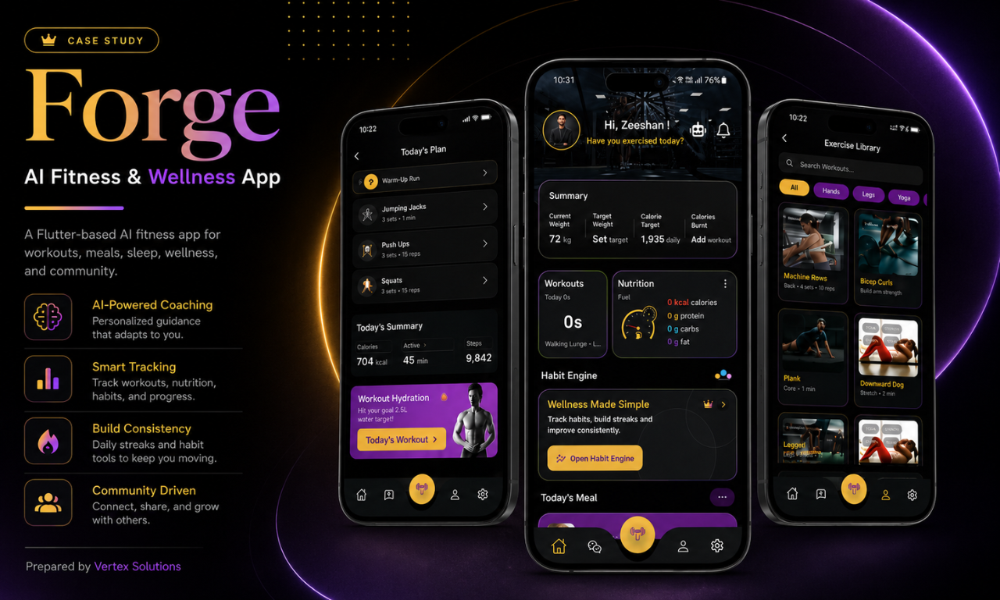
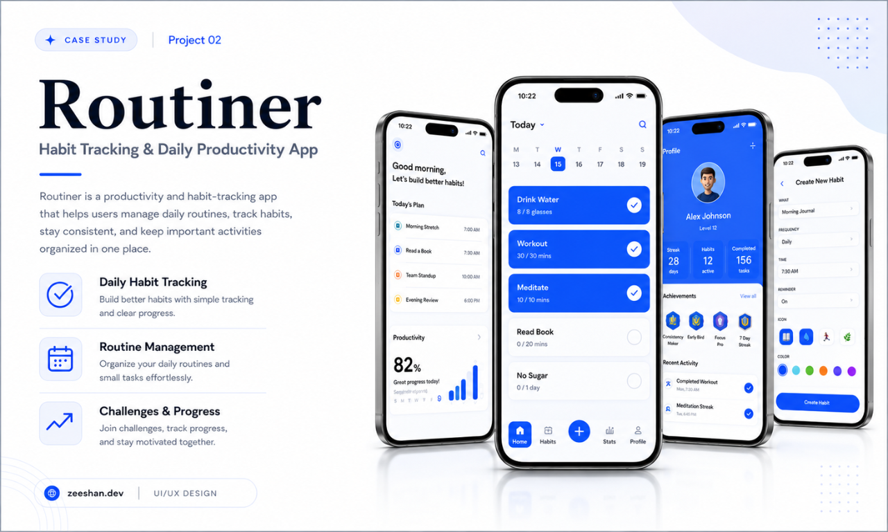
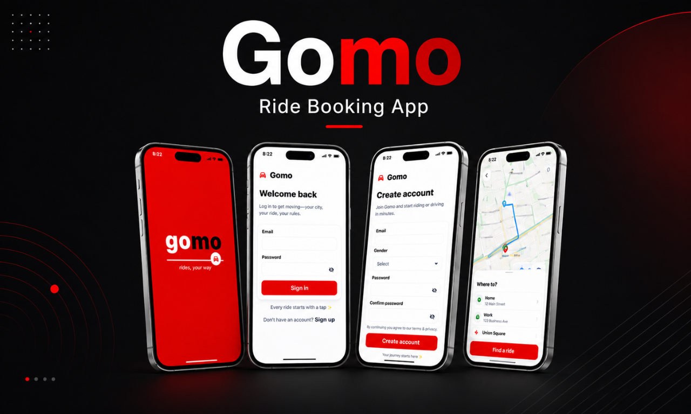
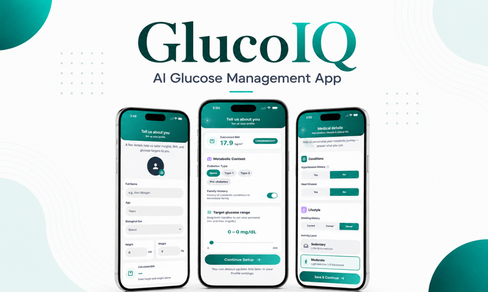
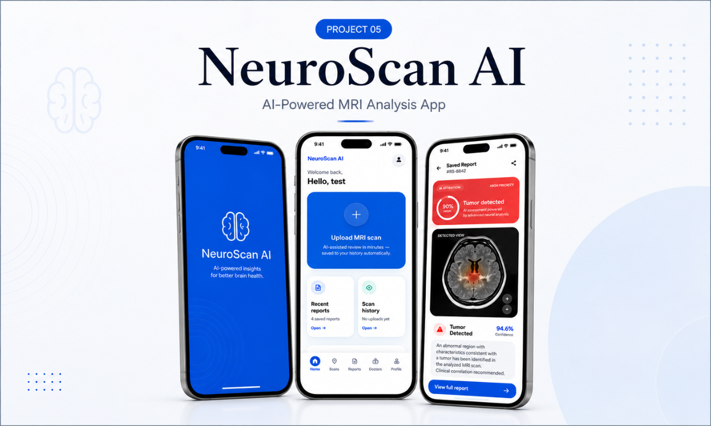

 
 

 
 

---

## 👨‍💻 About Me

I am a **Flutter Developer** focused on building modern, scalable, and production-ready mobile applications with beautiful UI, smooth user experience, and strong backend integration.

I work on complete app development from **UI/UX implementation** to **authentication**, **APIs**, **dashboards**, **role-based flows**, **Firebase/Supabase integration**, and **production-ready builds**.

<table>
  <tr>
    <td align="center" width="25%">
      <h3>🚀 Mobile Apps</h3>
      
Flutter Android/iOS apps with responsive layouts and smooth user flows.

    </td>
    <td align="center" width="25%">
      <h3>🎨 UI/UX</h3>
      
Pixel-perfect Flutter UI from Figma, XD, screenshots, and custom mockups.

    </td>
    <td align="center" width="25%">
      <h3>🧱 Architecture</h3>
      
Clean Architecture, feature-first structure, reusable widgets, and scalable code.

    </td>
    <td align="center" width="25%">
      <h3>☁️ Backend</h3>
      
Firebase, Supabase, REST APIs, Auth, Storage, PostgreSQL, and realtime data.

    </td>
  </tr>
</table>

---

## 🧰 Languages & Tools

---

## 🧠 Core Skills

<table>
  <tr>
    <td align="center" width="220"><b>📱 Mobile Development</b></td>
    <td>Flutter, Dart, Android, iOS, Responsive UI, Animations</td>
  </tr>
  <tr>
    <td align="center"><b>🏗️ Architecture</b></td>
    <td>Clean Architecture, Feature-first Structure, MVVM, Maintainable Code</td>
  </tr>
  <tr>
    <td align="center"><b>⚙️ State Management</b></td>
    <td>BLoC, Provider, Riverpod</td>
  </tr>
  <tr>
    <td align="center"><b>☁️ Backend</b></td>
    <td>Firebase, Supabase, REST APIs, PostgreSQL, Realtime Data</td>
  </tr>
  <tr>
    <td align="center"><b>🛠️ Tools</b></td>
    <td>Git, GitHub, Postman, Figma, Adobe XD, Android Studio, VS Code</td>
  </tr>
</table>

---

# 🚀 Featured Projects

### Professional mobile app projects and UI/UX case studies

---

## 01 — Forge  
### AI Fitness & Wellness App

Forge is an AI-powered fitness and wellness app designed for workouts, meals, sleep, habit building, wellness tracking, and community engagement.

**Key Features**

- AI-powered personal coaching  
- Workout planning and fitness tracking  
- Nutrition and calorie summary  
- Habit engine for consistency  
- Community-driven fitness experience  
- Premium dark mobile UI design  

**Tech Stack**

`Flutter` `Dart` `AI App UI` `Fitness App` `Clean Architecture` `Responsive UI`

---

## 02 — Routiner  
### Habit Tracking & Daily Productivity App

Routiner is a productivity and habit-tracking app that helps users manage routines, track habits, stay consistent, and monitor daily progress.

**Key Features**

- Daily habit tracking  
- Routine and task management  
- Progress dashboard  
- Achievement system  
- Create habit flow  
- Clean productivity-focused UI  

**Tech Stack**

`Flutter` `Dart` `Productivity App` `Habit Tracker` `Clean UI` `Mobile App Design`

---

## 03 — Gomo  
### Ride Booking App

Gomo is a modern ride-booking app concept with onboarding, authentication, account creation, map interface, and ride search flow.

**Key Features**

- Splash and branding screen  
- Sign in and create account flow  
- Map-based ride booking UI  
- Destination search  
- Saved locations  
- Modern transport app design  

**Tech Stack**

`Flutter` `Dart` `Ride Booking App` `Maps UI` `Auth Flow` `Mobile UI`

---

## 04 — GlucoIQ  
### AI Glucose Management App

GlucoIQ is an AI glucose management app concept focused on health profile setup, metabolic details, glucose range, lifestyle tracking, and personalized health insights.

**Key Features**

- Health profile setup  
- BMI and glucose range UI  
- Medical details flow  
- Lifestyle tracking  
- Personalized health experience  
- Clean healthcare app design  

**Tech Stack**

`Flutter` `Dart` `Health App` `AI App UI` `Medical App` `Form Flow`

---

## 05 — NeuroScan AI  
### AI-Powered MRI Analysis App

NeuroScan AI is an AI-powered MRI analysis app designed to upload MRI scans, analyze results, view AI detection output, and manage scan reports.

**Key Features**

- MRI scan upload flow  
- AI analysis result screen  
- Scan history  
- Saved reports  
- Tumor detection UI  
- Healthcare-focused app design  

**Tech Stack**

`Flutter` `Dart` `Firebase` `AI Integration` `Medical AI App` `MRI Analysis`

---

## 💼 What I Can Build

<table>
  <tr>
    <td align="center" width="25%">
      <h3>📱 Flutter Apps</h3>
      
Android and iOS mobile applications with modern responsive UI.

    </td>
    <td align="center" width="25%">
      <h3>🧾 POS Systems</h3>
      
Billing, inventory, receipts, sales reports, and business workflows.

    </td>
    <td align="center" width="25%">
      <h3>🏥 Healthcare Apps</h3>
      
Medical, fitness, AI, patient, lab, and report-based applications.

    </td>
    <td align="center" width="25%">
      <h3>🔐 Auth Systems</h3>
      
Firebase/Supabase authentication, roles, storage, and realtime data.

    </td>
  </tr>
  <tr>
    <td align="center" width="25%">
      <h3>📊 Dashboards</h3>
      
Admin panels, analytics modules, charts, reports, and management tools.

    </td>
    <td align="center" width="25%">
      <h3>🎨 UI Implementation</h3>
      
Pixel-perfect Flutter screens from Figma, XD, screenshots, and mockups.

    </td>
    <td align="center" width="25%">
      <h3>☁️ Backend Apps</h3>
      
REST APIs, PostgreSQL, Supabase database, storage, and cloud integration.

    </td>
    <td align="center" width="25%">
      <h3>🚀 Optimization</h3>
      
Bug fixing, performance improvement, app polish, and production builds.

    </td>
  </tr>
</table>

---

## 📈 GitHub Activity

 
 

 
 

 
 

 
 

---

## 🤝 Let's Work Together

I am available for **Flutter mobile app development**, **UI implementation**, **Firebase/Supabase integration**, **dashboard apps**, **POS systems**, and **production-ready business applications**.

 

 
 

<h3>🚀 Building clean, scalable, and beautiful mobile applications</h3>

