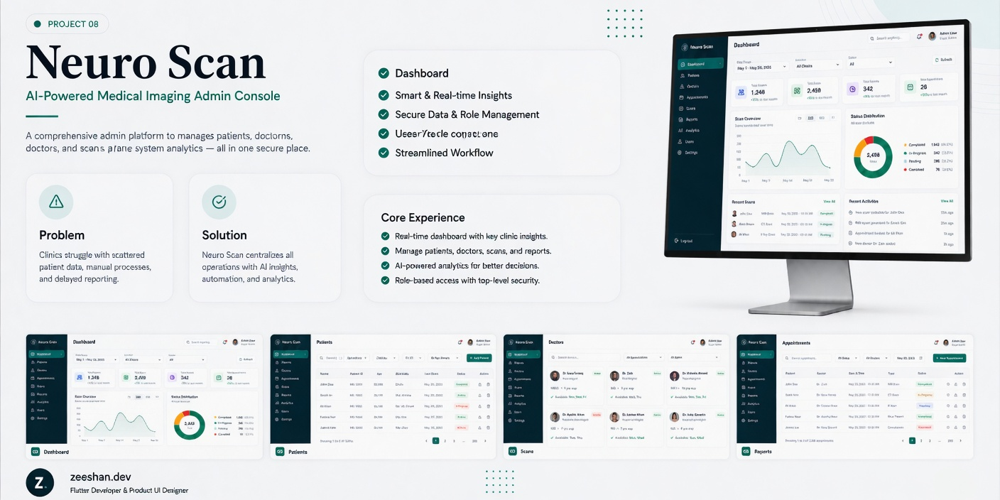
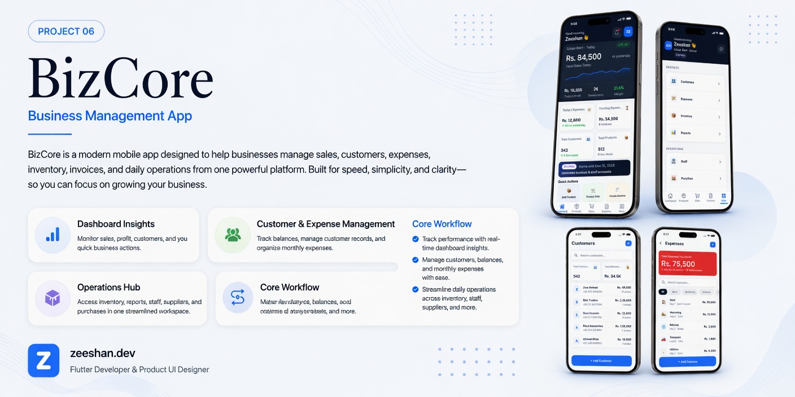
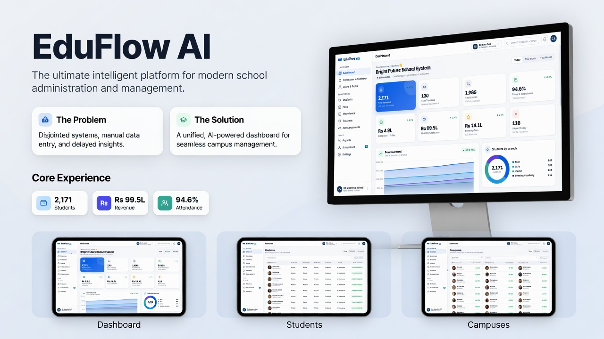
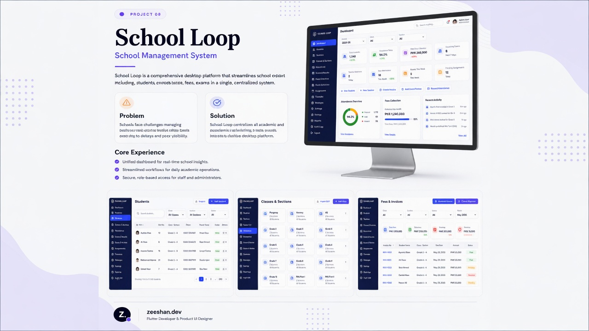

# 👋 Hi, I'm Zeeshan Ashraf

### Flutter Developer • AI Integration Engineer • Mobile App Developer

 

I build **modern, scalable, AI-powered mobile applications** with clean architecture, smooth user experience, and production-ready backend integrations.

 

<a href="https://zeeshanashraf.dev"><b>🌐 Portfolio</b></a>
&nbsp;&nbsp;•&nbsp;&nbsp;
<a href="mailto:admin@zeeshanashraf.dev"><b>📩 Email</b></a>
&nbsp;&nbsp;•&nbsp;&nbsp;
<a href="https://github.com/zeeeshaan"><b>💻 GitHub</b></a>
&nbsp;&nbsp;•&nbsp;&nbsp;
<a href="https://www.instagram.com/zeeshan.dev1"><b>📸 Instagram</b></a>

  

---

## 👨‍💻 About Me

I am a **Flutter Developer and AI Integration Engineer** focused on building clean, scalable, and business-ready mobile applications.  
My work combines **beautiful UI**, **strong app architecture**, **backend integration**, and **AI-powered features** to create applications that are useful, reliable, and ready for real users.

---

## 🚀 What I Do

<table>
  <tr>
    <td align="center" width="25%">
      <h3>📱 Mobile Apps</h3>
      
Flutter Android/iOS apps with smooth UX and responsive UI.

    </td>
    <td align="center" width="25%">
      <h3>🤖 AI Integration</h3>
      
AI assistants, smart insights, prediction flows, and intelligent app features.

    </td>
    <td align="center" width="25%">
      <h3>🧱 Architecture</h3>
      
Clean Architecture, feature-first structure, MVVM, and scalable code.

    </td>
    <td align="center" width="25%">
      <h3>☁️ Backend</h3>
      
Firebase, Supabase, REST APIs, authentication, databases, and dashboards.

    </td>
  </tr>
</table>

---

## 🧰 Languages & Tools

---

## 🧠 Core Skills

<table>
  <tr>
    <td align="center" width="250"><b>📱 Mobile Development</b></td>
    <td>Flutter, Dart, Android, iOS, responsive layouts, animations, app optimization</td>
  </tr>
  <tr>
    <td align="center"><b>🤖 AI App Integration</b></td>
    <td>AI assistants, smart recommendations, AI reports, health/fitness intelligence, app automation</td>
  </tr>
  <tr>
    <td align="center"><b>🏗️ Architecture</b></td>
    <td>Clean Architecture, feature-first structure, MVVM, reusable components</td>
  </tr>
  <tr>
    <td align="center"><b>⚙️ State Management</b></td>
    <td>BLoC, Provider, Riverpod, scalable app state handling</td>
  </tr>
  <tr>
    <td align="center"><b>☁️ Backend Integration</b></td>
    <td>Firebase, Supabase, REST APIs, PostgreSQL, authentication, storage, real-time data</td>
  </tr>
  <tr>
    <td align="center"><b>🛠️ Tools</b></td>
    <td>Git, GitHub, Postman, Figma, Android Studio, VS Code</td>
  </tr>
</table>

---

## 🚀 Featured Projects

### Professional Flutter apps, AI-powered products, and UI/UX case studies

---

## 01 — Forge  
### AI Fitness & Wellness App

 

 

 

 

**Forge** is an AI-powered fitness and wellness application designed for workouts, nutrition, habits, sleep tracking, and community engagement.  
The project focuses on a clean mobile experience, AI-driven coaching, habit building, workout tracking, and personalized wellness insights.

**Key Features:** AI Coaching • Workout Planning • Habit Engine • Nutrition Tracking • Sleep Tracking • Community  
**Tech Stack:** `Flutter` `Dart` `Clean Architecture` `Firebase` `AI Integration`

## 02 — Routiner  
### Habit Tracking & Productivity App

**Routiner** is a productivity and habit-tracking app that helps users manage routines, track daily habits, and monitor progress through a clean mobile experience.

**Key Features:** Daily Tracking • Routine Management • Progress Dashboard • Achievements  
**Tech Stack:** `Flutter` `Dart` `Clean UI` `State Management`

---

## 03 — NeuroScan AI  
### AI-Powered MRI Analysis App

**NeuroScan AI** is a medical AI platform built for MRI scan upload, AI-assisted analysis, report management, and secure healthcare workflows.

**Key Features:** MRI Upload • AI Detection • Report History • Secure Dashboard  
**Tech Stack:** `Flutter` `Dart` `Firebase` `AI Integration`

---

## 04 — BizCore  
### Business Management App

**BizCore** is a business management application for handling sales, inventory, customers, expenses, and invoicing in one modern system.

**Key Features:** Sales Dashboard • Inventory • Customer Management • Invoicing  
**Tech Stack:** `Flutter` `Dart` `Clean Architecture`

---

## 05 — EduFlow AI  
### Smart School Management System

**EduFlow AI** is an intelligent school management system with multi-campus support, attendance, fees, academic operations, and AI assistant features.

**Key Features:** Multi-campus Dashboard • Attendance • Fees • AI Assistant  
**Tech Stack:** `Flutter` `Dart` `Firebase` `Clean Architecture` `AI Integration`

---

## 06 — School Loop  
### School Management System

**School Loop** is a complete school management platform for student records, attendance, classes, fees, and academic reporting.

**Key Features:** Unified Dashboard • Attendance • Fee Collection • Reports  
**Tech Stack:** `Flutter` `Dart` `Desktop + Mobile`

---

## 07 — Gomo  
### Ride Booking App

**Gomo** is a modern ride-booking application with map integration, authentication, destination search, and a smooth booking flow.

**Key Features:** Map Booking • Auth Flow • Destination Search • Modern UI  
**Tech Stack:** `Flutter` `Dart` `Maps Integration`

---

## 08 — GlucoIQ  
### AI Glucose Management App

**GlucoIQ** is an AI-powered healthcare application for glucose tracking, lifestyle insights, personalized reports, and clean health data visualization.

**Key Features:** Health Profile • Glucose Tracking • AI Insights • Reports  
**Tech Stack:** `Flutter` `Dart` `AI Integration` `Healthcare UI`

---

## 09 — NeuroScan AI Admin  
### Medical Imaging Admin Console

**NeuroScan AI Admin** is an admin dashboard for managing patients, doctors, scans, reports, and AI analytics in one secure console.

**Key Features:** Real-time Dashboard • Role-based Access • AI Analytics • Reports  
**Tech Stack:** `Flutter` `Dart` `Firebase` `Clean Architecture`

---

## 💼 What I Can Build

<table>
  <tr>
    <td align="center" width="25%">
      <h3>📱 Flutter Apps</h3>
      
Android and iOS apps with modern UI and smooth performance.

    </td>
    <td align="center" width="25%">
      <h3>🤖 AI Apps</h3>
      
AI assistants, AI reports, smart recommendations, and intelligent workflows.

    </td>
    <td align="center" width="25%">
      <h3>🏥 Healthcare Apps</h3>
      
Fitness, medical, glucose, wellness, and AI-powered health platforms.

    </td>
    <td align="center" width="25%">
      <h3>🧾 Business Systems</h3>
      
POS, inventory, invoices, dashboards, authentication, and reports.

    </td>
  </tr>
</table>

---

## 📈 GitHub Activity

  

  

  

---

## 🤝 Let's Work Together

### Need a clean, scalable, AI-powered Flutter app?

I am available for **Flutter development**, **AI feature integration**, **Firebase/Supabase integration**, **UI implementation**, and **business mobile applications**.

 

<table>
  <tr>
    <td align="center">
      <a href="mailto:admin@zeeshanashraf.dev"><b>📩 Hire Me</b></a>
    </td>
    <td align="center">
      <a href="https://zeeshanashraf.dev"><b>🌐 Portfolio</b></a>
    </td>
    <td align="center">
      <a href="https://github.com/zeeeshaan"><b>💻 GitHub</b></a>
    </td>
    <td align="center">
      <a href="https://www.instagram.com/zeeshan.dev1"><b>📸 Instagram</b></a>
    </td>
  </tr>
</table>

 

  

